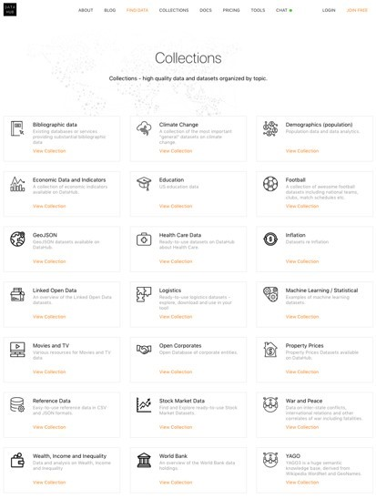
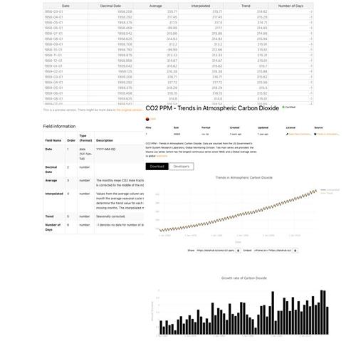
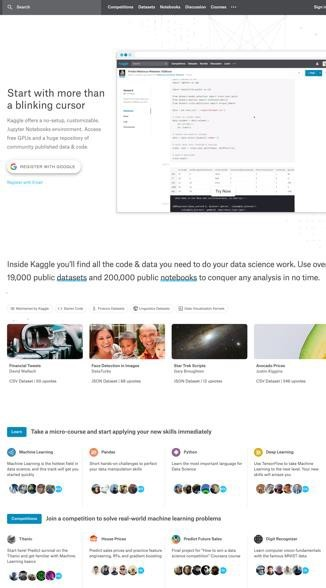
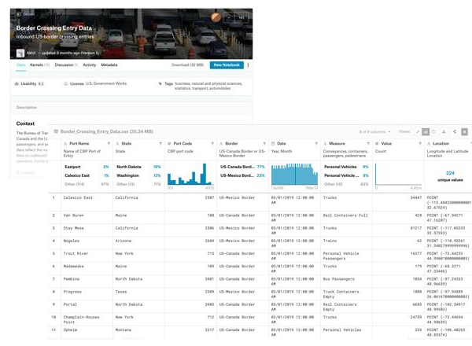

---
hide:
# - toc
# - navigation
title: Dónde encontrar buenos ejemplos de datos en formato CSV
---

# Dónde encontrar buenos ejemplos de datos en formato CSV

- Se incluye a continuación la descripción de dos iniciativas que publican conjuntos de Datos Abiertos destacables por la alta calidad de los datasets disponibles en formato CSV:

	- [Datahub.io](https://datahub.io/)
	- [Kaggle.com](https://www.kaggle.com/)

- En estas plataformas cobra especial trascendencia la calidad en la forma que se publican los datos, dado el sólido entendimiento sobre la naturaleza multipropósito del uso de los datos y el tratamiento profesional de los mismos, que se encuentra en los fundamentos de ambas iniciativas.
- Datahub, destaca por implementar un soporte integral para transformar, validar y publicar datos de calidad y Kaggle constituye uno de los repositorios de conjuntos de datos y conocimiento en torno al análisis de datos de referencia profesional más importantes.
- Ambas iniciativas constituyen ejemplos reales de buenas prácticas en el tratamiento de archivos CSV que pueden ser tenidas en cuenta para abordar procesos de preparación y publicación de Datos Abiertos

## datahub.io

- [Datahub](https://datahub.io/) es una plataforma web que da soporte integral a flujos de trabajo para la preparación y publicación de Datos Abiertos. Está diseñada para preparar, catalogar y publicar datos de alta calidad haciendo uso del conjunto de [herramientas Frictionless Data](https://frictionlessdata.io/).
- El conjunto de herramientas Frictionless Data, es una colección de especificaciones y aplicaciones para la preparación de archivos de datos, entre las que se encuentra “Goodtables”, descrita en el apartado “Toolbox para archivos CSV” de esta guía. { align=right}
- Datahub, contiene colecciones de datos compatibles con Datos Abiertos de alto valor como: cambio climático, datos económicos e indicadores, estadística, logística, registros empresariales con origen en fuentes oficiales. 
- Cada entrada de datos disponible contiene un conjunto de elementos para mostrar las propiedades del dataset (esquema y recursos de datos), opciones de descarga de datos en diversos formatos, entre ellos CSV, vistas de las tablas de datos y visualizaciones simples.
- Proporciona, además, acceso directo para importar los datos utilizando una variedad de herramientas habituales en el contexto profesional: R, Python, JavaScript y SQL.

Un **ejemplo** de [dataset](https://datahub.io/core/co2-ppm) en formato CSV disponible en la plataforma es el que muestra la tendencia de Dióxido de Carbono en la atmósfera, con origen en el “US Government's Earth System Research Laboratory”.

<figure markdown> 
  { width="500" }
  <figcaption></figcaption>
</figure>

El archivo CSV descargable del dataset "CO2 PPM - Trends in Atmospheric Carbon Dioxide" posee las siguientes características:

- Diccionario de datos procesable en formato JSON según la especificación Data Package.
- Fila única de cabecera.
- Registro único por fila.
- Comprensible nombrado de columnas.
- Estructura de datos vertical.
- Tratamiento de valores desconocidos, indicados por valores del tipo -99.99 (para el atributo ‘average’) y -1 (para el atributo ‘días’).
- No	contiene	totales	niagrupaciones.
- Correcto tipado de campos.
- Campo de  fechas codificado siguiendo el estándar ISO- 8601.
- No contiene datos con coordenadas geográficas o campos codificados.

``` 
Date,Decimal Date,Average,Interpolated
,Trend,Number of Days
1958-03-01,1958.208,315.71,315.71,314.62,-1
1958-04-01,1958.292,317.45,317.45,315.29,-1
1958-05-01,1958.375,317.50,317.50,314.71,-1
1958-06-01,1958.458,-99.99,317.10,314.85,-1
1958-07-01,1958.542,315.86,315.86,314.98,-1
1958-08-01,1958.625,314.93,314.93,315.94,-1
1958-09-01,1958.708,313.20,313.20,315.91,-1
1958-10-01,1958.792,-99.99,312.66,315.61,-1
1958-11-01,1958.875,313.33,313.33,315.31,-1
1958-12-01,1958.958,314.67,314.67,315.61,-1
1959-01-01,1959.042,315.62,315.62,315.70,-1
1959-02-01,1959.125,316.38,316.38,315.88,-1
1959-03-01,1959.208,316.71,316.71,315.62,-1
1959-04-01,1959.292,317.72,317.72,315.56,-1
1959-05-01,1959.375,318.29,318.29,315.50,-1
1959-06-01,1959.458,318.15,318.15,315.92,-1
1959-07-01,1959.542,316.54,316.54,315.66,-1
1959-08-01,1959.625,314.80,314.80,315.81,-1
1959-09-01,1959.708,313.84,313.84,316.55,-1
1959-10-01,1959.792,313.26,313.26,316.19,-1
1959-11-01,1959.875,314.80,314.80,316.78,-1
1959-12-01,1959.958,315.58,315.58,316.52,-1
…
2014-12-01,2014.958,398.91,398.91,399.64,29
2015-01-01,2015.042,399.98,399.98,399.69,30
2015-02-01,2015.125,400.28,400.28,399.51,27
2015-03-01,2015.208,401.54,401.54,400.05,24
2015-04-01,2015.292,403.28,403.28,400.49,27
2015-05-01,2015.375,403.96,403.96,400.63,30
2015-06-01,2015.458,402.80,402.80,400.50,28
2015-07-01,2015.542,401.31,401.31,400.92,23
2015-08-01,2015.625,398.93,398.93,400.84,28
2015-09-01,2015.708,397.63,397.63,401.15,25
2015-10-01,2015.792,398.29,398.29,401.59,28
```

## kaggle.com

- { align=right}Kaggle es una plataforma web donde empresas e instituciones proponen problemas estratégicos o de negocio para que grupos con interés o experiencia en análisis de datos compitan, de forma remunerada, para crear y proponer las mejores soluciones.
- En la plataforma se presenta cualquier tipo de problema a resolver que pueda encontrarse en distintos ámbitos del mundo real, tales como servicios financieros, energía, sociedad, tecnología de la información, etc.
- Además de las competiciones propuestas y la disponibilidad de recursos de código para analizar cualquier conjunto de datos, Kaggle alberga cientos de conjuntos de datos de todo tipo y tamaño que se pueden descargar y usar de forma gratuita, mayoritariamente en formato CSV.
- Cada conjunto de datos contiene una descripción detallada de su contenido y dispone de una vista previa del contenido del archivo mediante un explorador de datos.
<br><br>
- Los archivos incluyen la especificación del esquema de datos asociado incluyendo descripciones de columna con sus correspondientes metadatos: tipos de datos, rango de valores, unidades, histograma, etc. Las descripciones se asignan a nivel de tabla y a nivel de columna individual facilitando su comprensión.

- Cada dataset, además, posee un valoración otorgada por la comunidad de usuarios sobre su grado de usabilidad en base a aspectos como la facilidad para entender el contenido mediante la calidad de descriptores esenciales: de archivo, de columnas, etiquetas, licencia, procedencia, frecuencia de actualización etc.

Un **ejemplo** es el dataset que contiene los  datos de entrada  del cruce de fronteras del US Bureau of Transportation Statistics (BTS).


<figure markdown> 
  { width="600" }
  <figcaption></figcaption>
</figure>

- El archivo CSV  descargable del dataset  "Border crossing entry  data" posee  las siguientes características:

	- Diccionario de datos especificado en forma de tabla pero no procesable por máquina. Un aspecto de mejora es su disponibilidad en formato JSON enlazado desde el sitio web de descarga.
	- Fila única de cabecera.
	- Registro único por fila.
	- Comprensible nombrado de columnas.
	- Estructura de datos vertical.
	- No contiene totales ni agrupaciones.
	- Correcto tipado de campos.
	- Campo de fechas codificado siguiendo el estándar ISO-8601.
	- Codificación de códigos postales.
	- Coordenadas geográficas en grados decimales indicadas como punto geográfico de latitud-longitud.

```
Port Name,State,Port Code,Border,Date,Measure,Value,Location
Calexico East,California,2507,US-Mexico Border,03/01/2019 12:00:00 AM,Trucks,34447,POINT (- 115.48433000000001 32.67524)
Van Buren,Maine,108,US-Canada Border,03/01/2019 12:00:00 AM,Rail Containers Full,428,POINT (- 67.94271 47.16207)
Otay Mesa,California,2506,US-Mexico Border,03/01/2019 12:00:00 AM,Trucks,81217,POINT (- 117.05333 32.57333)
Nogales,Arizona,2604,US-Mexico Border,03/01/2019 12:00:00 AM,Trains,62,POINT (-110.93361
31.340279999999996)
Trout River,New York,715,US-Canada Border,03/01/2019 12:00:00 AM,Personal Vehicle Passengers,16377,POINT (-73.44253 44.990010000000005)
Madawaska,Maine,109,US-Canada Border,03/01/2019 12:00:00 AM,Trucks,179,POINT (-68.3271
47.35446)
Pembina,North Dakota,3401,US-Canada Border,03/01/2019 12:00:00 AM,Bus Passengers,1054,POINT (-97.24333 48.96639)
Progreso,Texas,2309,US-Mexico Border,03/01/2019 12:00:00 AM,Truck Containers Empty,1808,POINT (-97.94889 26.061670000000003)
Portal,North Dakota,3403,US-Canada Border,03/01/2019 12:00:00 AM,Rail Containers Empty,6685,POINT (-102.54917 48.99583)
Champlain-Rouses Point,New York,712,US-Canada Border,03/01/2019 12:00:00
AM,Trucks,24759,POINT (-73.44694 44.98639)
Opheim,Montana,3317,US-Canada Border,03/01/2019 12:00:00 AM,Personal Vehicles,235,POINT (- 106.40265 48.85574)

```