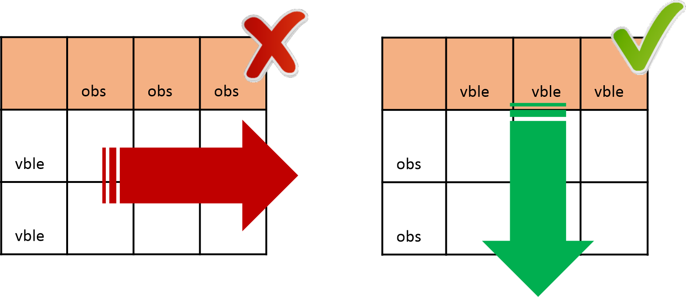

---
hide:
 - toc
# - navigation
title:  Estructuras de datosverticales vs horizontales
---

# Estructuras de datosverticales vs horizontales

- Cuando se diseñan estructuras de datos tabulares es recomendable evitar el crecimiento horizontal de valores.

- Siempre que sea posible es preferible situar las variables o atributos de los datos en las columnas de una tabla y añadir los valores correspondientes a las observaciones de los mismos en las filas.
- El crecimiento horizontal de una estructura de datos tabular puede dificultar su mantenimiento y la confección de visualizaciones.
- Por lo general, es más fácil identificar relaciones entre variables en columnas que entre filas y es más fácil hacer comparaciones entre grupos de observaciones, en filas, que entre grupos de columnas.
- No obstante, esta recomendación debe ajustarse según las necesidades de actualización de los datos:
	- Si es necesario registrar nuevas variables o atributos que no se habían registrado previamente, por ejemplo: una serie temporal, entonces es razonable el crecimiento horizontal de la estructura de datos. es decir, añadir nuevas columnas. Esto permitirá insertar observaciones para las nuevas variables manteniendo valores en blanco en las observaciones previas a la actualización para estas nuevas columnas, si es que no existe un valor asignable a esas observaciones. Al añadir nuevas observaciones, necesariamente tienen que introducirse nuevas filas.

## Ejemplo: crecimiento horizontal vs vertical
<figure markdown> 
  { width="auto" }
  <figcaption></figcaption>
</figure>

!!! failure "Mala práctica"

    <table class="tabella">
    	<tbody>
    		<tr class="arancione_grassetto">
			<td>
				
marca

			</td>
			<td>
				
averias_radiador

			</td>
			<td>
				
averias_carburador

			</td>
			<td>
				
averias_suspension

			</td>
			<td>
				
averias_embrague

			</td>
		</tr>
		<tr>
			<td>
				
chevrolet chevelle malibu

			</td>
			<td>
				
0

			</td>
			<td>
				
7

			</td>
			<td>
				
1

			</td>
			<td>
				
0

			</td>
		</tr>
		<tr>
			<td>
				
buick skylark 320

			</td>
			<td>
				
1

			</td>
			<td>
				
2

			</td>
			<td>
				
2

			</td>
			<td>
				
2

			</td>
		</tr>
		<tr>
			<td>
				
plymouth satellite

			</td>
			<td>
				
0

			</td>
			<td>
				
4

			</td>
			<td>
				
4

			</td>
			<td>
				
1

			</td>
		</tr>
	</tbody>
</table>

!!! success "Buena práctica"

    <table class="tabella">
    	<tbody>
    		<tr class="arancione_grassetto">
			<td>
				
marca

			</td>
			<td>
				
tipo_averia

			</td>
			<td>
				
cantidad_averias

			</td>
		</tr>
		<tr>
			<td>
				
chevrolet chevelle malibu

			</td>
			<td>
				
radiador

			</td>
			<td>
				
0

			</td>
		</tr>
		<tr>
			<td>
				
chevrolet chevelle malibu

			</td>
			<td>
				
carburador

			</td>
			<td>
				
7

			</td>
		</tr>
		<tr>
			<td>
				
chevrolet chevelle malibu

			</td>
			<td>
				
suspensi&oacute;n

			</td>
			<td>
				
1

			</td>
		</tr>
		<tr>
			<td>
				
chevrolet chevelle malibu

			</td>
			<td>
				
embrague

			</td>
			<td>
				
0

			</td>
		</tr>
		<tr>
			<td>
				
buick skylark 320

			</td>
			<td>
				
radiador

			</td>
			<td>
				
1

			</td>
		</tr>
		<tr>
			<td>
				
buick skylark 320

			</td>
			<td>
				
carburador

			</td>
			<td>
				
2

			</td>
		</tr>
		<tr>
			<td>
				
buick skylark 320

			</td>
			<td>
				
suspensi&oacute;n

			</td>
			<td>
				
2

			</td>
		</tr>
		<tr>
			<td>
				
buick skylark 320

			</td>
			<td>
				
embrague

			</td>
			<td>
				
2

			</td>
		</tr>
		<tr>
			<td>
				
plymouth satellite

			</td>
			<td>
				
radiador

			</td>
			<td>
				
0

			</td>
		</tr>
		<tr>
			<td>
				
plymouth satellite

			</td>
			<td>
				
carburador

			</td>
			<td>
				
4

			</td>
		</tr>
		<tr>
			<td>
				
plymouth satellite

			</td>
			<td>
				
suspensi&oacute;n

			</td>
			<td>
				
4

			</td>
		</tr>
		<tr>
			<td>
				
plymouth satellite

			</td>
			<td>
				
embrague

			</td>
			<td>
				
1

			</td>
		</tr>
	</tbody>
</table>

En el ejemplo se observa una forma de disponer los datos evitando el crecimiento horizontal de la estructura de datos agregando nuevas variables similares a las existentes. La trasposición a una estructura vertical mediante la creación de dos variables nuevas, “tipo_averia” y “cantidad_averias”, permite añadir fácilmente nuevas observaciones en forma de filas.	

En cambio, cuando se publican series temporales, por ejemplo, el histórico de demanda de vehículos entre los años 1972-1977, es razonable el crecimiento horizontal de la estructura si surge la necesidad, por ejemplo, de completar la serie histórica de los años ‘70.

!!! success "Buena práctica"

    <table class="tabella">
    	<tbody>
    		<tr class="arancione_grassetto">
			<td>
				
marca

			</td>
			<td>
				
1972

			</td>
			<td>
				
1973

			</td>
			<td>
				
1974

			</td>
			<td>
				
1975

			</td>
			<td>
				
1976

			</td>
			<td>
				
1977

			</td>
		</tr>
		<tr>
			<td>
				
chevrolet chevelle malibu

			</td>
			<td>
				
345

			</td>
			<td>
				
423

			</td>
			<td>
				
1234

			</td>
			<td>
				
1690

			</td>
			<td>
				
2345

			</td>
			<td>
				
2134

			</td>
		</tr>
		<tr>
			<td>
				
buick skylark 320

			</td>
			<td>
				
124

			</td>
			<td>
				
252

			</td>
			<td>
				
785

			</td>
			<td>
				
914

			</td>
			<td>
				
1353

			</td>
			<td>
				
896

			</td>
		</tr>
		<tr>
			<td>
				
plymouth satellite

			</td>
			<td>
				
57

			</td>
			<td>
				
71

			</td>
			<td>
				
165

			</td>
			<td>
				
315

			</td>
			<td>
				
1104

			</td>
			<td>
				
1561

			</td>
		</tr>
	</tbody>
</table>