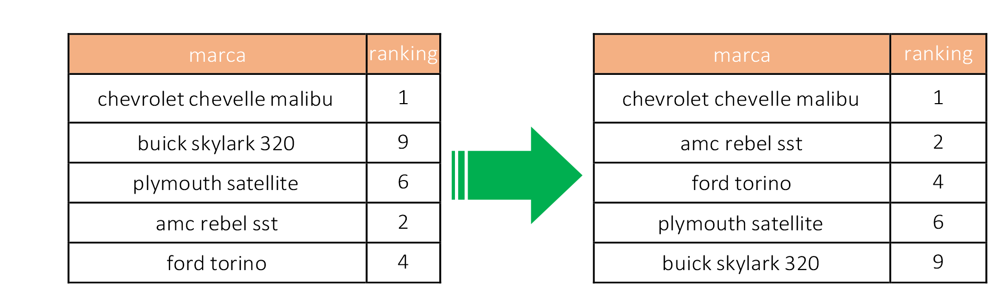
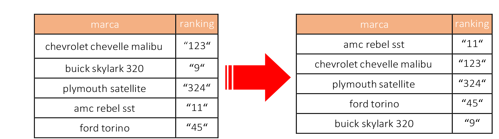

---
hide:
 - toc
# - navigation
title: Campos numéricos
---

# Campos numéricos

- Los campos numéricos deben codificarse exclusivamente como tipos de datos numéricos (enteros o decimales). Si no es así, determinadas operaciones con los datos, como por ejemplo una ordenación, pueden generar problemas inesperados.
- A tener en cuenta:
	- De forma general:
		- No se deben usar separadores de millares. Tampoco espacios en blanco como separadores.
		- El separador decimal puede ser una ‘,’ o un ‘.’, depende de la configuración regional de las aplicaciones de tratamiento de datos. En España, Francia o Alemania, entre otros países, se usa la ‘,’ y en al ámbito anglosajón el ‘.’. El uso de uno u otro carácter separador puede implicar el preprocesado de los datos para su reutilización con determinadas herramientas y lenguajes de programación.
		- Los valores negativos deben ir precedidos de un signo menos (-). No usar paréntesis para indicar valores negativos.
		- Si una columna contiene valores enteros y decimales, el tipo de dato debe ser decimal y por tanto, se incluirá el separador ‘,’ o ‘.’ y el número de cifras decimales que proceda, normalmente dos decimales.
		- Si una columna solo contiene valores enteros, se expresarán sin separador decimal.
		- No se debe mezclar texto con valores numéricos. Por ejemplo: no se debe usar 50€ o 27 km como valor en un campo numérico.
	- Recomendaciones en el caso de moneda:
		- Los valores numéricos deben expresarse sin decimales o con 2 decimales.
		- No debe variar el número de decimales usados para dar formato a toda la columna de valores. Si varía, se vulnera la característica de consistencia de los datos.
		- No incluir símbolo de moneda, ni separadores de millares (puntos o comas, según sea el caso).
		
- Recomendaciones en el caso de unidades de medida:
	- Se deben usar los espacios decimales que sean necesarios.
	- Es recomendable utilizar el diccionario de datos para expresar las unidades de medida asociadas a valores numéricos. Si se carece de diccionario, es posible indicar la unidad de medida en el nombre del campo, por ejemplo: ”distancia_metros”, siempre y cuando todos los valores de la columna tengan asociada la misma unidad de medida.
	- En el caso de que la unidad de medida tenga diferentes valores para una misma columna, los valores correspondientes a cada unidad de medida den indicarse en una columna separada seguida de la columna que contiene el valor numérico.
	- Por ejemplo:

<table class="tabella">
   	<tbody>
   		<tr class="arancione_grassetto">
			<td>
				
marca

			</td>
			<td>
				
precio_venta

			</td>
			<td>
				
moneda

			</td>
		</tr>
		<tr>
			<td>
				
chevrolet chevelle malibu

			</td>
			<td>
				
23540,20

			</td>
			<td>
				
EUR

			</td>
		</tr>
		<tr>
			<td>
				
buick skylark 320

			</td>
			<td>
				
22189,00

			</td>
			<td>
				
EUR

			</td>
		</tr>
		<tr>
			<td>
				
plymouth satellite

			</td>
			<td>
				
28362,65

			</td>
			<td>
				
USD

			</td>
		</tr>
		<tr>
			<td>
				
amc rebel sst

			</td>
			<td>
				
29200,00

			</td>
			<td>
				
USD

			</td>
		</tr>
	</tbody>
</table>

- Recomendaciones en el caso de números que indican valores codificados:

	- Cuando existen ceros como números de cabecera de valores que si son significativos, deben ser tipificados como valores de texto para evitar que éstos sean truncados. Por ejemplo: Código con valor: "00000023456”.
	
# Ejemplo 1: evitar el uso de separadores de miles. Uso de coma decimal. Consistencia en

!!! failure "Mala práctica"

    <table class="tabella">
    	<tbody>
    		<tr class="arancione_grassetto">
				<td>
				
marca

			</td>
			<td>
				
ingresos_ventas

			</td>
		</tr>
		<tr>
			<td>
				
chevrolet chevelle malibu

			</td>
			<td>
				
1.234.454,34 ?

			</td>
		</tr>
		<tr>
			<td>
				
buick skylark 320

			</td>
			<td>
				
2.345.567,892 euros

			</td>
		</tr>
		<tr>
			<td>
				
plymouth satellite

			</td>
			<td>
				
344,678.23

			</td>
		</tr>
		<tr>
			<td>
				
amc rebel sst

			</td>
			<td>
				
267.331

			</td>
		</tr>
		<tr>
			<td>
				
ford torino

			</td>
			<td>
				
1.234678.67

			</td>
		</tr>
	</tbody>
</table>
			
!!! success "Buena práctica"

    <table class="tabella">
    	<tbody>
    		<tr class="arancione_grassetto">
			<td>
				
marca

			</td>
			<td>
				
Ingresos_ventas

			</td>
		</tr>
		<tr>
			<td>
				
chevrolet chevelle malibu

			</td>
			<td>
				
1234454,34

			</td>
		</tr>
		<tr>
			<td>
				
buick skylark 320

			</td>
			<td>
				
2345567,89

			</td>
		</tr>
		<tr>
			<td>
				
plymouth satellite

			</td>
			<td>
				
344678,23

			</td>
		</tr>
		<tr>
			<td>
				
amc rebel sst

			</td>
			<td>
				
267331,00

			</td>
		</tr>
		<tr>
			<td>
				
ford torino

			</td>
			<td>
				
1234678,67

			</td>
		</tr>
	</tbody>
</table>
			
En este ejemplo, la moneda que se utiliza para todos los valores del campo “ingresos_ventas” es la misma y se describirá en el diccionario de datos. En su defecto, el nombre del campo podría ser “ingresos_ventas_euros”

# Ejemplo 2: usar el número de cifras decimales adecuado a cada tipo de datos numérico. Usar el signo menos (-) para valores negativos. Tipificar como texto valores con ceros significativos.	

!!! failure "Mala práctica"

    <table class="tabella">
    	<tbody>
    		<tr class="arancione_grassetto">
				<td>
				
identificador_marca

			</td>
			<td>
				
punto_kilometrico

			</td>
			<td>
				
latitud

			</td>
			<td>
				
longitud

			</td>
		</tr>
		<tr>
			<td>
				
345600

			</td>
			<td>
				
2.3

			</td>
			<td>
				
43,2345678

			</td>
			<td>
				
(5,1234567)

			</td>
		</tr>
		<tr>
			<td>
				
0000345601

			</td>
			<td>
				
12,56

			</td>
			<td>
				
43,345

			</td>
			<td>
				
-5,2345678

			</td>
		</tr>
	</tbody>
</table>
			
			

!!! success "Buena práctica"

    <table class="tabella">
    	<tbody>
    		<tr class="arancione_grassetto">
				<td>
				
identificador_marca

			</td>
			<td>
				
punto_kilometrico

			</td>
			<td>
				
latitud

			</td>
			<td>
				
longitud

			</td>
		</tr>
		<tr>
			<td>
				
0000345600

			</td>
			<td>
				
2,334

			</td>
			<td>
				
43,2345678

			</td>
			<td>
				
-5,1234567

			</td>
		</tr>
		<tr>
			<td>
				
0000345601

			</td>
			<td>
				
12,567

			</td>
			<td>
				
43,3456789

			</td>
			<td>
				
-5,2345678

			</td>
		</tr>
	</tbody>
</table>

# Ejemplo 3: comportamiento ante un proceso de ordenación en campos

- **Caso 1**: resultado correcto tras un proceso de ordenación cuando el campo “ranking” es de tipo “numérico”.

<figure markdown> 
  { width="auto" }
  <figcaption></figcaption>
</figure>

- **Caso 2**: resultado erróneo tras un proceso de ordenación cuando el campo “Ranking” es de tipo “texto”.

<figure markdown> 
  { width="auto" }
  <figcaption></figcaption>
</figure>

En este último ejemplo, se están incluyendo las comillas que abarcan a cada cadena de números con el objetivo de hacer más explicito el ejemplo, pero en una hoja de cálculo real no tienen porque ser visibles aun cuando el campo es de tipo “texto”.

Una buena práctica es comprobar en el sistema u hoja de cálculo donde se genera el archivo o por medio de una herramienta de validación como las que se detallan en el apartado “Toolbox para archivos CSV” cada tipo de datos antes de su publicación.