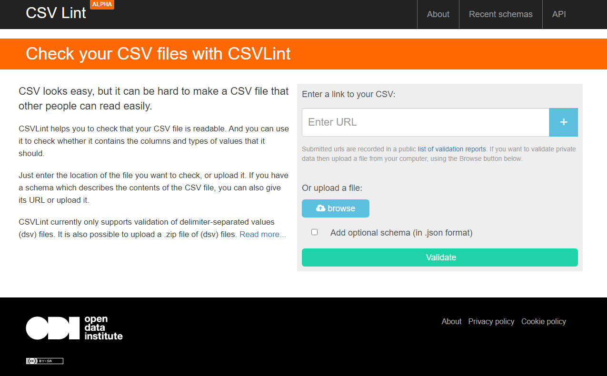
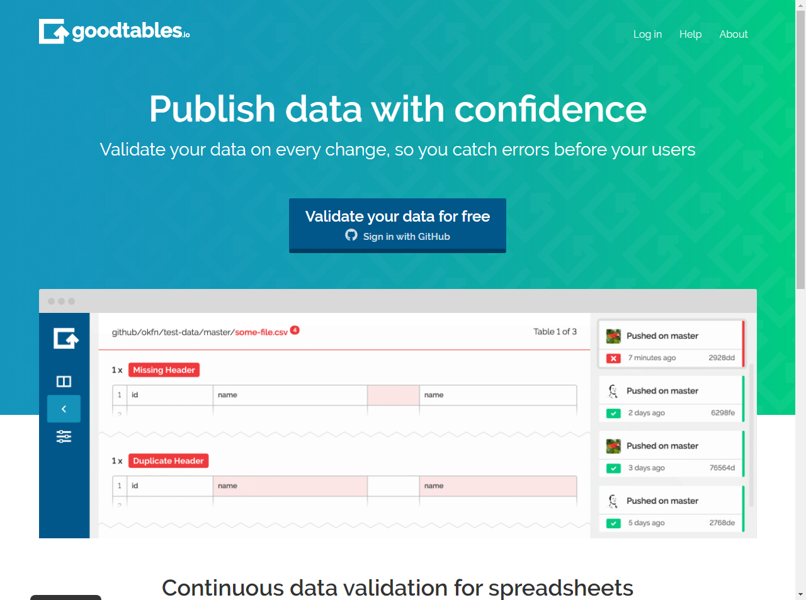
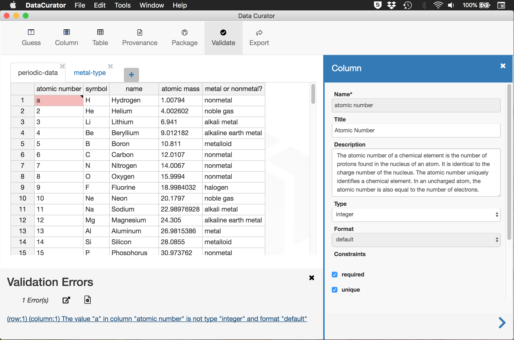
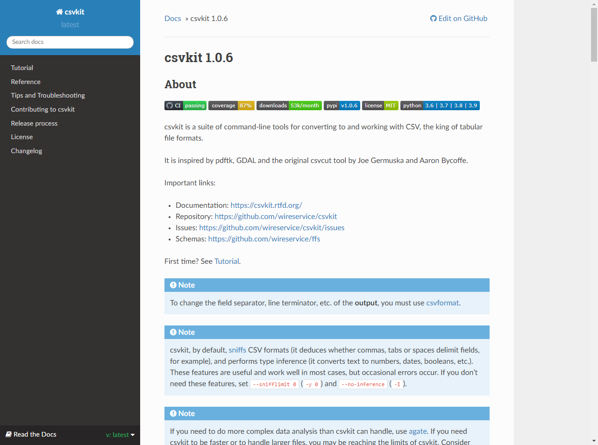

---
hide:
# - toc
# - navigation
title: Toolbox para archivos CSV
---

# Toolbox para archivos CSV

- Existen herramientas para el tratamiento de archivos CSV que aportan diferentes funcionalidades.
- Son herramientas gratuitas que normalmente se ofrecen como servicio, es decir, están disponibles online y no requieren la instalación de software o en su caso, ésta es mínima.
- Por lo general, son capaces de validar estructuras de datos o lo que es lo mismo, la consistencia entre el número de campos de cabecera y los existentes en cada una de las filas de datos además de la consistencia de los tipos y valores de los datos de cada celda.
- Destacan por su facilidad de uso y funcionalidad:

<table xmlns="http://www.w3.org/1999/xhtml">
	<tbody>
		<tr class="arancione">
			<td></td>
			<td>Servicio / Suite de herramientas</td>
			<td>Validaci&oacute;n de estructura</td>
			<td>Limpieza De datos</td>
			<td>Conversi&oacute;n de formatos</td>
		</tr>
		<tr>
			<td>CSVLint</td>
			<td>On line</td>
			<td>✅</td>
			<td>❌</td>
			<td>❌</td>
		</tr>
		<tr>
			<td>Goodtables</td>
			<td>On line</td>
			<td>✅</td>
			<td>❌</td>
			<td>❌</td>
		</tr>
		<tr>
			<td>Data Curator</td>
			<td>Suite</td>
			<td>✅</td>
			<td>✅</td>
			<td>✅</td>
		</tr>
		<tr>
			<td>CSVkit</td>
			<td>Suite</td>
			<td>❌</td>
			<td>✅</td>
			<td>✅</td>
		</tr>
	</tbody>
</table>

## Herramienta: CSVlint

- **[CSVLint](https://csvlint.io/)** es una herramienta disponible online gestionada por [Open Data Institute](http://www.theodi.org/) para verificar que un archivo CSV es perfectamente legible y está bien formado, es decir, valida si contiene las columnas y los tipos de valores que debería. Permite validar archivos y esquemas de tablas de datos en CSV.
- El análisis se realiza sobre archivos subidos directamente a **[CSVLint](https://csvlint.io/)** o disponibles online.
- El análisis devuelve información sobre errores, necesariamente corregibles para usar los datos, advertencias, cuya subsanación ayuda a los usuarios de los datos y mensajes informativos sobre determinados consejos y sugerencias para facilitar el uso de los datos.
- La herramienta genera un distintivo que es posible embeber en el sitio web
del propietario de archivo CSV usando el correspondiente código HTML.
- Algunos errores de codificación de caracteres son corregidos automáticamente, generando una nueva versión estandarizada del archivo CSV original.
- **[CSVLint](https://csvlint.io/)** guarda un registro de las validaciones y esquemas recientemente utilizados que puede ser útil para identificar errores comunes.

<figure markdown> 
  [{ width="auto" }](https://csvlint.io/)
  <figcaption>Disponible en: <a href="https://csvlint.io/" target="_blank">csvlint.io</a></figcaption>
</figure>

## Herramienta: Goodtables

- **[Googtables](https://goodtables.io/)** es un servicio  de  validación  continua  para  datos  tabulares de [Open Knowledge Foundation](https://okfn.org/) (OKI) que permite la verificación de errores y problemas comunes en archivos de datos tabulares.
- Como servicio de validación permite que Goodtables pueda ser integrado en diferentes flujos de publicación de Datos Abiertos.
- Valida tanto datos tabulares en diferentes formatos: CSV, Microsoft Excel o LibreOffice Calc, como esquemas en formato JSON
- Permite, además, la validación directa de datos tabulares albergados sobre Github o Amazon S3.
- Soporta *Tabular Data Package* que es un formato simple para publicar y compartir datos tabulares promovido desde el proyecto [FrictionLess Data](https://frictionlessdata.io/) de OKI que combina datos archivados como CSV, esquemas de tablas y metadatos según la especificación [Data Package](https://frictionlessdata.io/docs/data-package/).
- **[Googtables](https://goodtables.io/)** está disponible como librería de Python de tal forma que pueda ser invocada para cargar y validar tablas de datos.

<figure markdown> 
  [{ width="auto" }](https://goodtables.io)
  <figcaption>Disponible en: <a href="https://goodtables.io/" target="_blank">goodtables.io</a></figcaption>
</figure>

## Herramienta: Data Curator

- **[Data Curator](https://github.com/ODIQueensland/data-curator)** es una herramienta de escritorio implementada por [Open Data Institute]_(https://theodi.org.au/data-curator/) que permite la edición, validación y publicación de archivos de datos tabulares reutilizables como Datos Abiertos.
- Con esta herramienta es posible generar datos tabulares (CSV, TSV, entre otros), partiendo de cero o a partir de plantillas de estructuras de datos y esquemas.
- Automáticamente corrige problemas comunes encontrados en archivos CSV y Excel.
- Es posible, crear de forma automática, esquemas que describen los campos de datos  e  incluir reglas especificas  de  validación (por ejemplo,  valores únicos, obligatorios, de longitud mínima o máxima, o sujetos a expresiones regulares), al igual que permite describir la procedencia de los datos.
- La herramienta valida el archivo de datos contra el esquema definido y genera archivos de valores separados en los diversos dialectos CSV (comas, puntos y comas, tabuladores o campos de ancho fijo).
- Permite encapsular datos y esquema para exportar utilizando la especificación Data Package.
- Además, los archivos de datos descritos y validados pueden se publicados directamente sobre portales de datos CKAN.

<figure markdown> 
  [{ width="auto" }](https://github.com/ODIQueensland/data-curator)
  <figcaption>Disponible en: <a href="https://github.com/ODIQueensland/data-curator" target="_blank">Data Curator</a></figcaption>
</figure>

## Herramienta: Csvkit

- **[CSVkit](https://csvkit.readthedocs.io/en/latest/) son un conjunto de herramientas para usar desde línea de comandos en entornos Linux / MacOS que permite convertir y trabajar con archivos CSV.
- Entre otras funcionalidades útiles, **[CSVkit](https://csvkit.readthedocs.io/en/latest/) permite: convertir archivos Excel o JSON a CSV y viceversa; realizar diferentes operaciones a nivel de columna, fila o celda; generar sumarios estadísticos y realizar consultas SQL sobre los datos.
- Además realiza determinados análisis de los datos e infiere algunas de sus características como la ausencia / presencia de cabecera o tipos de datos.

<figure markdown> 
  [{ width="auto" }](https://csvkit.readthedocs.io/en/latest/)
  <figcaption>Disponible en: <a href="https://csvkit.readthedocs.io/en/latest/" target="_blank">CSVkit</a></figcaption>
</figure>