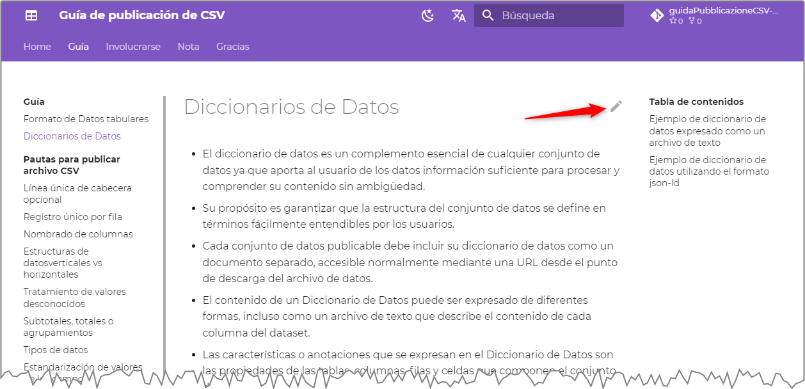

---
hide:
 - toc
 - navigation
title: Involucrarse
---

Esta **guía** es un **bien común**, tanto de **lector** como de **autor**.

!!! info

    El texto de ayuda es lo que encuentra en la carpeta. [`docs`](https://github.com/ondata/guidaPraticaPubblicazioneCSV/tree/main/docs) de [este *repositorio* GitHub](https://github.com/ondata/guidaPraticaPubblicazioneCSV/).<br>


Como **lector**, eres **libre** para:
- **Compartir** - reproducir, distribuir, comunicar al público, exhibir en público, representar, interpretar y actuar este material en cualquier medio y formato
- **Edición** - remezclar, transformar el material y construir sobre él para sus trabajos
para cualquier propósito, incluido el comercial.

Bajo las siguientes condiciones:
- **Atribución**: debe reconocer la autoría correspondiente, proporcionar un enlace a la licencia e indicar si se han realizado cambios. Puede hacer esto de cualquier manera razonable posible, pero no de una manera que sugiera que el licenciante lo respalda a usted o su uso del material.
- **Sin restricciones adicionales** - No puede aplicar términos legales o medidas tecnológicas que impongan restricciones legales a otros en cuanto a lo que la licencia les permite hacer.

De **autor** puedes:

- si **no sabe cómo usar git y GitHu **, [** abra una nueva discusión aquí **] (https://github.com/ondata/guidaPraticaPubbubblicaCSV/discussions), con propuestas, sugerencias, preguntas o para mostrarnos para qué fue útil esta guía;
- si **sabes cómo usar git y GitHub**:
    - clonar el * repositorio * y hacer la * Pull Request *;
    - proponer cambios al texto y sugerir correcciones, usando la tecla <kbd> EDIT </kbd>, que se encuentra en cada página, en la parte superior derecha (ver imagen a continuación) y siempre haga * Pull Request *, pero más "visuales ", directamente desde la interfaz web.



## Mencionar esta guía

Para citar esta guía puede consultar este texto:

<span xmlns:dct="http://purl.org/dc/terms/" property="dct:title">"<a href="https://ondata.github.io/guidaPraticaPubblicazioneCSV/">Guía de publicación de CSV</a>"</span> de la <a xmlns:cc="http://creativecommons.org/ns#" href="https://ondata.it/" property="cc:attributionName" rel="cc:attributionURL">asociación onData</a>, distribuido bajo licencia <a rel="license" href="http://creativecommons.org/licenses/by/4.0/">Creative Commons Attribution 4.0 International (CC BY 4.0)</a> | <a rel="license" href="http://creativecommons.org/licenses/by/4.0/"></a>

O directamente a este código HTML:

```HTML
<span xmlns:dct="http://purl.org/dc/terms/" property="dct:title">"<a href="https://ondata.github.io/guidaPraticaPubblicazioneCSV/">Guía de publicación de CSV</a>"</span> de la <a xmlns:cc="http://creativecommons.org/ns#" href="https://ondata.it/" property="cc:attributionName" rel="cc:attributionURL">asociación onData</a>, distribuido bajo licencia <a rel="license" href="http://creativecommons.org/licenses/by/4.0/">Creative Commons Attribution 4.0 International (CC BY 4.0)</a> | <a rel="license" href="http://creativecommons.org/licenses/by/4.0/"></a>
```

Puedes escribir por ejemplo:

> Fuente: <span xmlns:dct="http://purl.org/dc/terms/" property="dct:title">"<a href="https://ondata.github.io/guidaPraticaPubblicazioneCSV/">Guía de publicación de CSV</a>"</span> de la <a xmlns:cc="http://creativecommons.org/ns#" href="https://ondata.it/" property="cc:attributionName" rel="cc:attributionURL">asociación onData</a>, distribuido bajo licencia <a rel="license" href="http://creativecommons.org/licenses/by/4.0/">Creative Commons Attribution 4.0 International (CC BY 4.0)</a> | <a rel="license" href="http://creativecommons.org/licenses/by/4.0/"></a>
